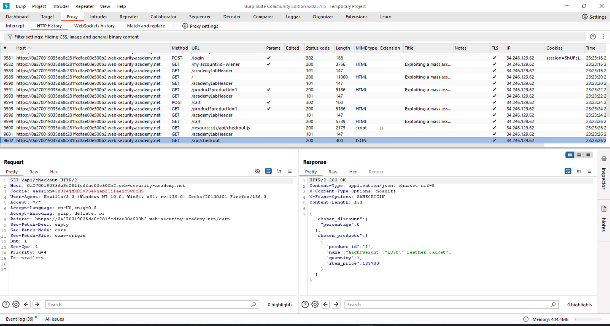

## First Lab
In the lab we are supposed to find the api documentation, which we can find through GET /api/ and then using DELETE method we delete user with name 'carlos'.

## Second Lab
First of all, through traversing the repeater we find that the content type is in json format, so we have to post our requests in json. 

Then using the PATCH api method we change the price of the product, so it eventually is free for us as we don't have any money on our account. 

## Third Lab
Lab 3 is almost the same as in a second one, but the main difference is we can find the parameters already in a Burp, what we need is a discount percentage, which we can change to 100 in a 
repeater which makes our product become free. 

## Fourth Lab
Fourth lab requires from us to find a reset_token, which url we can find eventually by searching for js file. 

It actually was hard to brute force, but eventually we can find right parameters which we can use in order to get to that reset token. 
First we tried the combination of &username=first&username=second which returns us the error code such as the username is invalid. We know that administrator already exists, so we can 
only hope to find its reset token. Using payload attack and injecting there a popular parameters we eventually find out that there is another parameter known as FIELD exists in a system.
Field is necessary to identify type of the value we are searching for. You can try email for a field, but earlier in a js file we have seen that reset_token is also a fieldname. So we 
use reset_token as a field name as shown below:

Here we find the token which we can eventually use to make new password using the url: /forgot-password?reset_token=${reset_token} (in a reset_token we place our token)
Which gives us a window to reset a password.

Then we do what was asked from us, delete the user called 'carlos' using the admin panel

The API section is finished. 

