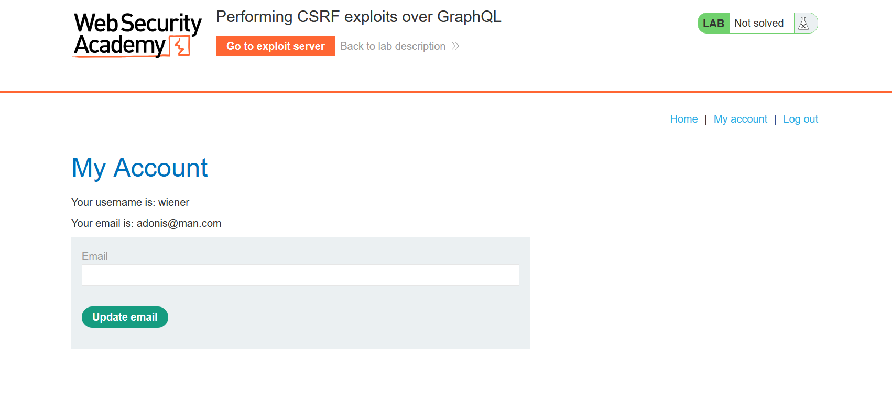

## First Lab
We put the graphql/v1 into scanner, where we find 2 queries, getter of all blogs and getter of a specific blog. From all blogs getter we can see that blog with id 3 is missing, which means it
has a isPrivate parameter true. So we go to specific blog getter and paste the id 3 and we get the password. 

## Second Lab
In second lab, we used the same graphql/v1 endpoint, and we got it through iql scanner. There we can find getUser query, which we are gonna need. 
Then we run it in repeater in order to find the password, traversing the ids, and fortunately the first ID is for administrator. 
After that we log in with administrators credentials and go to the admin panel, where we can find the username Carlos, which we need to delete. 

## Third Lab
Searching for graphql did not lead to anything as the endpoint is hidden in this lab. So we find that /login has post and we send it to intruder with some default name types of endpoints. 
And there we can find /api and we send it to repeater, which tells us that POST method is not allowed for the endpoint, and we use GET. As it requires from us a query, we try introspection
schemas, and by finding out that newline bypasses the introspection defense, we can find the payloads for introspection from this git source: https://github.com/swisskyrepo/PayloadsAllTheThings/blob/master/GraphQL%20Injection/README.md

After doing so, we get heavy json format, which we can save on our pc, and then in a BURP iql scanner paste it in there, after which we find the getUser and DeleteOrganizationUser queries. 

We use first query in order to find out the id of Carlos, which is 3. Then the last thing we do is delete the user, using the query given in a DeleteOrganizationUser query.

## Fourth Lab
We find the graphql/v1 instantly and then we send it to repeater. We get the login mutation query, but we currently need to do something to bypass its exception handlers.
So we can use a multiple query senders, using the login_${ID}: login(input: {password: "", username: ""}) {token, success} queries. 
We can find some authentication passwords for lab from next link:  https://portswigger.net/web-security/authentication/auth-lab-passwords

After selecting our clean queries from console to BURP repeater, we send the request and we seek for token with success value true and it is login number 33. We have found the password for carlos.

## Fifth Lab
As we are going to exploit CSRF we have to implement client side rendering and for that we are gonna need a HTML. So we change the application type of our graphql/v1 from /json
to /x-www-form-urlencoded. And after sending a request we get an error "Query not present". So what we need to do is to remake our json query into html url, and we get something like:
>       query=mutation%20changeEmail($input:ChangeEmailInput!){changeEmail(input: $input) {email}}&operationName=changeEmail&variables={"input":{"email":"black@man.com"}}

So sending the query will change the email on the lab page. So we can use the same html and deliver it to our victim, which will change their email adress to mine, and in theory it 
would have given me an access to their account as it was on my email. However I have submitted the code and delivered it to victim, but nothing happened and I honestly do not know why, cause
in the solution of the lab it was  supposed to work.

Maybe it is just my luck...
