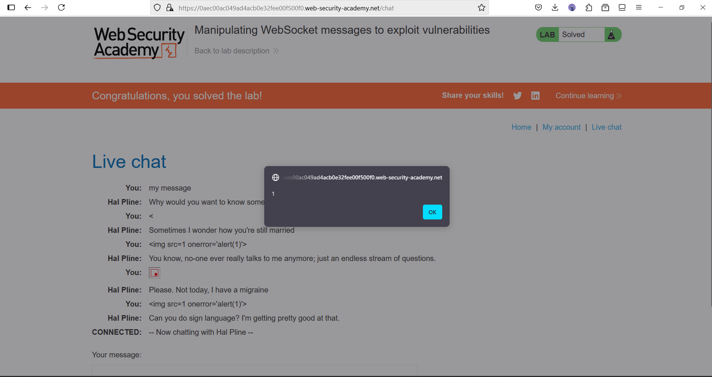
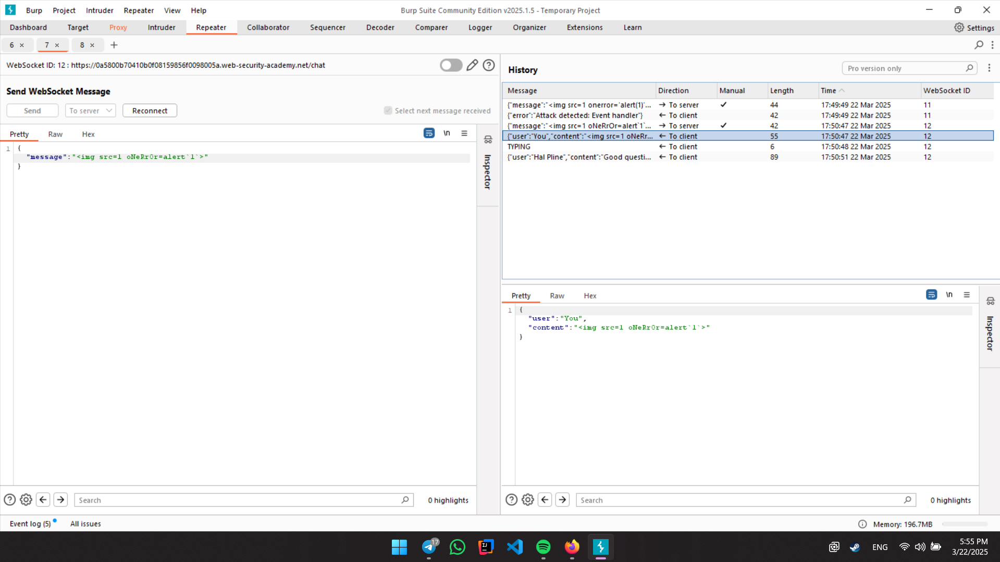
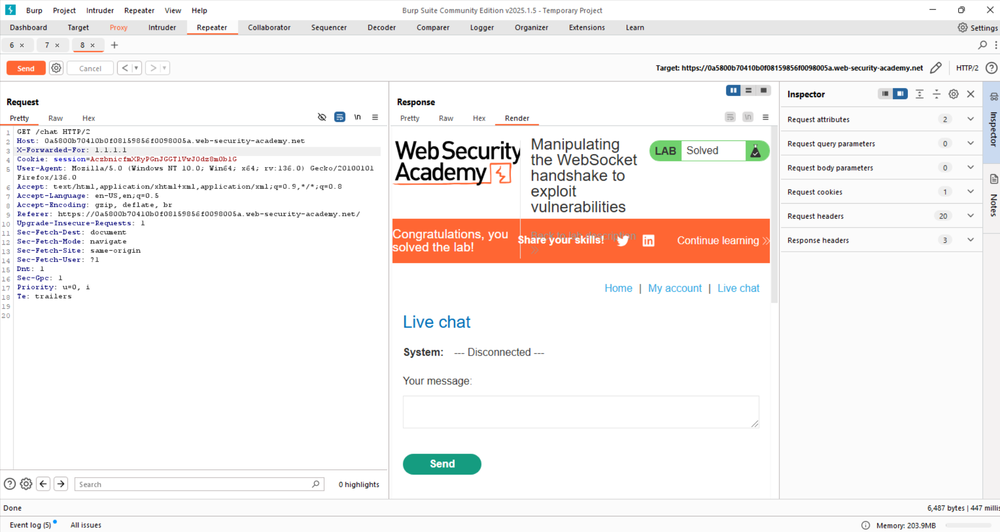
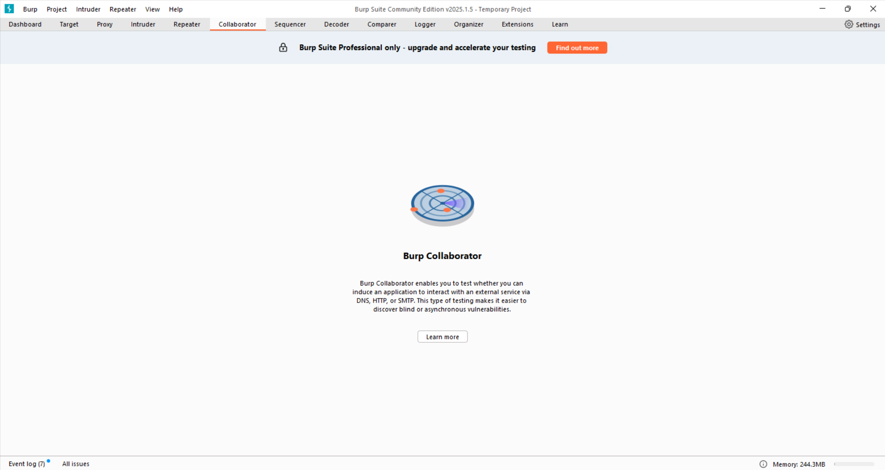
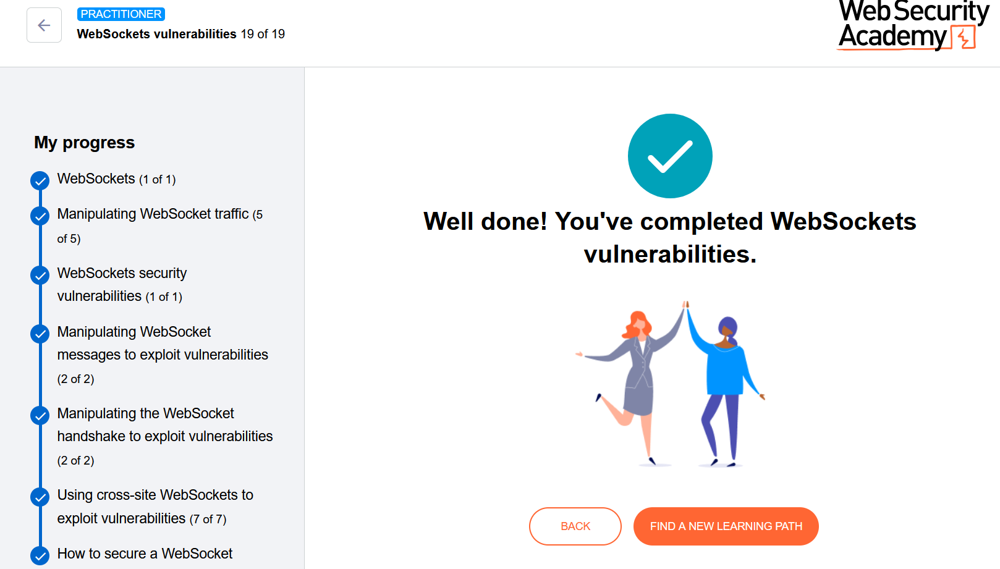

**First Lab
Just inject the xss attack through repeater. 

Solved: Img proof>>> 

**Second Lab
In here I intercepted websocket and sent the message sending http to repeater, where I first tried to inject simple xss which blocked my access. 
Then I reconnected by injecting X-Forwarded-For: 1.1.1.1 line in a http request, and got access through repeater, though I was still unable to access site for some reason, but I could render the http code by myself in the burp.

Solved: Img proof>>> 

**Third Lab

Can't do 3rd lab cause it requires a burp suite professional edition which costs some money)
But I got the idea of the lab, it was to spy on the users of webpage, trying to get a hand on their cookie session id, so that we could also enter webpage using the same cookie to get an access to sensitive information.

